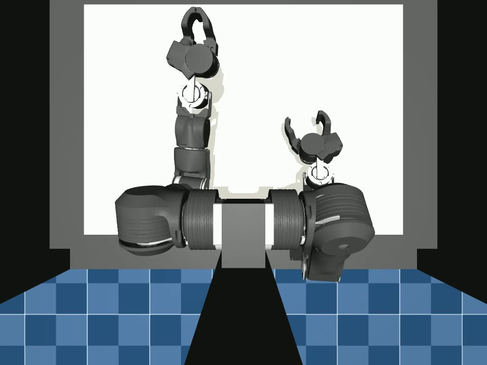
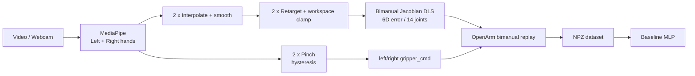
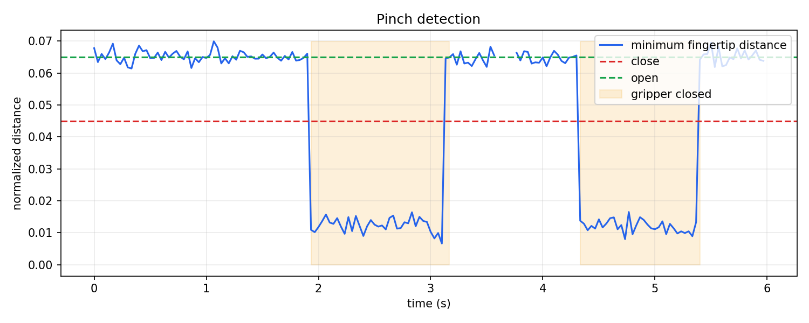
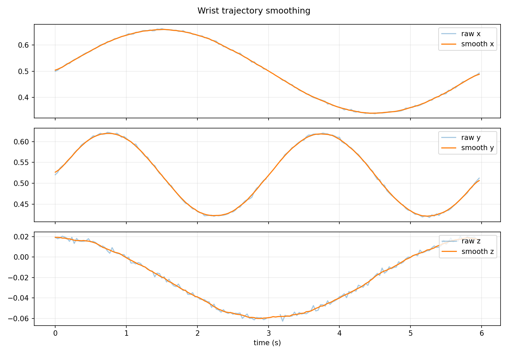
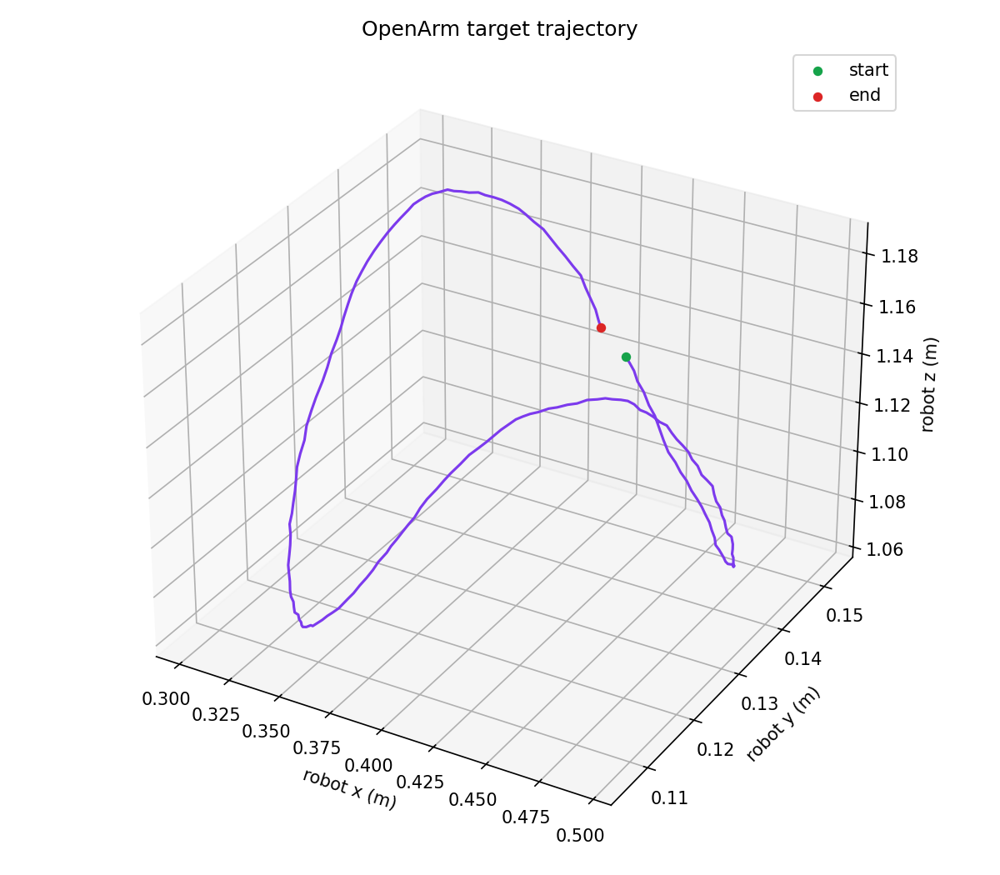
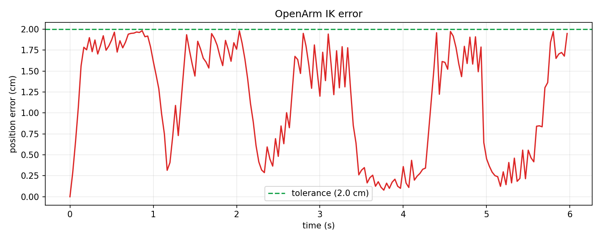
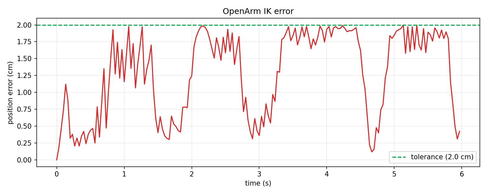

# Video to OpenArm

[](pyproject.toml)
[](https://mujoco.org/)
[](LICENSE)

Pipeline bimanual chuyển quỹ đạo và động tác pinch của **cả hai tay người**
thành chuyển động 14 joint, hai end-effector và hai gripper của OpenArm.

**Kết quả synthetic bimanual:** IK trung bình **1.22 cm**, lớn nhất
**2.00 cm**, hội tụ đồng thời **100%** trên 180 frame.

[Xem video replay MuJoCo hai tay](docs/demo/bimanual_openarm_replay.mp4)



## Kiến trúc



## Cài đặt

Python 3.10 trở lên:

```bash
python -m venv .venv
# Windows
.venv\Scripts\activate

python -m pip install --upgrade pip
python -m pip install -e ".[all,dev]"
python scripts/download_hand_model.py
python scripts/00_check_install.py
```

Model HandLandmarker không commit vào Git. Script tải model `Latest` từ
[nguồn chính thức của Google](https://storage.googleapis.com/mediapipe-models/hand_landmarker/hand_landmarker/float16/latest/hand_landmarker.task).

## Chạy nhanh

Quay video hai tay bằng camera máy tính:

```bash
openarm-retarget record
```

Trong cửa sổ camera:

- `SPACE`: bắt đầu hoặc tạm dừng quay.
- `Q` hoặc `ESC`: kết thúc và lưu.

File mặc định: `data/raw_videos/demo_001.mp4`.

Quay tự động 20 giây:

```bash
openarm-retarget record --auto-start --duration 20
```

Nếu máy có nhiều camera:

```bash
openarm-retarget record --camera 1
```

Ghi đè một video đã tồn tại:

```bash
openarm-retarget record --output data/raw_videos/demo_001.mp4 --overwrite
```

Preview được mirror để dễ thao tác, nhưng file video lưu khung hình gốc. Pipeline
sẽ mirror đúng một lần theo `configs/hand_tracking.yaml`.

Camera cần đặt **đối diện người**, gần ngang tầm bàn tay. Không đặt camera từ
trên xuống. Ánh xạ mặc định hiểu:

- ngang trên ảnh -> trái/phải của robot;
- dọc trên ảnh -> cao/thấp của robot;
- kích thước lòng bàn tay -> tiến/lùi của robot.

Ghép tracking người và robot thành một video đồng bộ:

```bash
openarm-retarget compare \
  --human outputs/debug_videos/demo_001_real_bimanual_hand_debug.mp4 \
  --robot outputs/replay_videos/demo_001_real_bimanual_openarm.mp4 \
  --output outputs/comparison/demo_001_human_vs_robot.mp4
```

Kết quả hiển thị tay người bên trái và OpenArm bên phải trong cùng một frame,
chung timeline nên không bị cửa sổ sau che cửa sổ trước.

Mở môi trường MuJoCo tương tác:

```bash
openarm-retarget viewer
```

Các biến thể:

```bash
# Giữ pose home, không chạy physics
openarm-retarget viewer --static

# Bật collision walls
openarm-retarget viewer --walls

# Lệnh gốc của package OpenArm cũng dùng được
openarm-mujoco-launch --keyframe home
```

Viewer cho phép quan sát model, camera, joint/control trong MuJoCo. Đây chưa
phải vòng lặp webcam điều khiển robot theo thời gian thực.

Chạy toàn bộ pipeline bằng dữ liệu synthetic và render MP4:

```bash
openarm-retarget demo --name bimanual_synthetic --frames 180 --render
```

Chạy từ video thật:

```bash
openarm-retarget demo \
  --video data/raw_videos/demo_001.mp4 \
  --name demo_001 \
  --render
```

Đầu ra nằm trong:

```text
data/hand_pose/
data/robot_targets/
data/robot_traj/
data/datasets/
outputs/plots/
outputs/debug_videos/
outputs/replay_videos/
outputs/<run_name>_bimanual_quality_report.json
```

## Các bước

### Bước 0: Kiểm tra môi trường

**Mục tiêu:** xác nhận Python và dependency trước khi xử lý dữ liệu.

```bash
python scripts/00_check_install.py
```

**Đạt khi:** core package báo `[OK]`; package tùy chọn cần cho luồng đang chạy
không báo thiếu.

### Bước 1: Inspect OpenArm

**Mục tiêu:** lấy đúng 14 joint, 14 arm actuator, 2 EE site, 2 gripper actuator
và keyframe từ model thay vì hard-code.

```bash
python scripts/01_inspect_openarm_model.py
```

**Output:** `outputs/openarm_model_report.txt`.

OpenArm MuJoCo 2.0.0 hiện được nhận diện với:

```text
model: cell.xml
left EE: left_ee_control_point
right EE: right_ee_control_point
left joints: openarm_left_joint1 ... openarm_left_joint7
right joints: openarm_right_joint1 ... openarm_right_joint7
left/right gripper: left_finger1_ctrl / right_finger1_ctrl
home EE: left [0.401, 0.1535, 1.12], right [0.401, -0.1535, 1.12] m
```

### Bước 2: Trích xuất hand pose

**Mục tiêu:** lấy riêng wrist và 5 fingertip của tay trái/phải bằng MediaPipe.

```bash
python scripts/02_extract_hand_pose.py \
  --video data/raw_videos/demo_001.mp4 \
  --output data/hand_pose/demo_001_hand_pose.npz \
  --debug-video outputs/debug_videos/demo_001_hand_debug.mp4
```

**Output:** `left_*`, `right_*`, hai valid mask và video debug màu riêng từng tay.

**Đạt khi:** cả `left_valid` và `right_valid` đạt tối thiểu 90%.

### Bước 3: Phát hiện pinch

**Mục tiêu:** tạo `left_gripper_cmd` và `right_gripper_cmd` độc lập.

```bash
python scripts/03_detect_pinch.py \
  --input data/hand_pose/demo_001_hand_pose.npz \
  --output data/hand_pose/demo_001_pinch.npz \
  --plot outputs/plots/demo_001_pinch.png
```

Hysteresis dùng hai ngưỡng: đóng ở `0.045`, mở ở `0.065`; vùng giữa giữ trạng
thái trước. Mỗi chuyển trạng thái phải ổn định ít nhất 3 frame để loại xung
pinch giả khi tay vừa vào khung.

Khoảng cách pinch là khoảng cách nhỏ nhất từ đầu ngón cái đến đầu ngón trỏ,
giữa, áp út hoặc út. Quy ước lệnh là `0 = gripper mở`, `1 = gripper đóng`.




### Bước 4: Làm mượt cổ tay

**Mục tiêu:** nội suy frame mất landmark, moving average và giới hạn vận tốc.

```bash
python scripts/04_smooth_wrist.py \
  --input data/hand_pose/demo_001_pinch.npz \
  --output data/hand_pose/demo_001_smooth.npz \
  --window 7 \
  --plot outputs/plots/demo_001_smoothing.png
```



### Bước 5: Retarget vào workspace OpenArm

**Mục tiêu:** ánh xạ trục camera sang robot, scale chuyển động và clamp workspace.

```bash
python scripts/05_retarget_wrist_to_openarm.py \
  --input data/hand_pose/demo_001_smooth.npz \
  --output data/robot_targets/demo_001_target.npz \
  --plot outputs/plots/demo_001_target.png
```

`configs/bimanual_retarget.yaml` có origin/workspace riêng cho mỗi bên và ánh
xạ mặc định cho camera đặt đối diện người.



### Bước 6: Giải IK

**Mục tiêu:** giải đồng thời sai số 6D của hai EE sang 14 arm joint bằng
Jacobian damped least-squares, có joint limit và velocity clamp.

```bash
python scripts/06_openarm_ik.py \
  --input data/robot_targets/demo_001_target.npz \
  --output data/robot_traj/demo_001_qpos.npz \
  --plot outputs/plots/demo_001_ik_error.png
```

**Đạt MVP:** mean error `< 5 cm`, không frame nào `> 20 cm`.




### Bước 7: Replay MuJoCo

**Mục tiêu:** phát lại cả 14 joint và hai gripper trong cùng timestep.

```bash
# Debug chính xác trajectory
python scripts/07_replay_openarm_mujoco.py \
  --traj data/robot_traj/demo_001_qpos.npz \
  --mode kinematic \
  --output outputs/replay_videos/demo_001.mp4

# Kiểm tra position actuators
python scripts/07_replay_openarm_mujoco.py \
  --traj data/robot_traj/demo_001_qpos.npz \
  --mode actuator
```

Video mặc định: `960x720`, `30 FPS`, camera tự do nhìn chính diện hai tay
robot. Replay động học gán đồng thời cả hai finger joint của mỗi gripper.

### Bước 8: Đóng gói dataset

**Mục tiêu:** tạo observation/action dataset có thể load lại mà không dùng
pickle.

```bash
python scripts/08_log_dataset.py \
  --smooth data/hand_pose/demo_001_smooth.npz \
  --target data/robot_targets/demo_001_target.npz \
  --traj data/robot_traj/demo_001_qpos.npz \
  --output data/datasets/demo_001_dataset.npz
```

Dataset chứa wrist, target, EE pose, 7+7 joint target và gripper state của cả hai
bên.

### Bước 9: Baseline policy

**Mục tiêu:** kiểm tra dataset có học được quan hệ state-to-next-action.

```bash
python scripts/09_train_baseline_policy.py \
  --dataset data/datasets/demo_001_dataset.npz \
  --output models/openarm_baseline.joblib
```

Baseline dùng MLP cho 14 arm joints và classifier riêng cho mỗi gripper. Đây là
sanity check, không thay thế bimanual IK.

## Kiểm thử

```bash
pytest -q
```

Test suite bao phủ schema hai tay, pinch độc lập, smoothing, retarget, model
discovery, Jacobian `6x14`, hai gripper, dataset và pipeline bimanual end-to-end.

## Cấu hình

| File | Nội dung |
|---|---|
| `configs/hand_tracking.yaml` | MediaPipe backend, confidence, handedness |
| `configs/pinch.yaml` | Ngưỡng close/open và invalid policy |
| `configs/retarget.yaml` | Origin, scale, axis mapping, workspace |
| `configs/bimanual_retarget.yaml` | Origin/workspace riêng tay trái và phải |
| `configs/ik.yaml` | Tolerance, damping, step và velocity limit |
| `configs/openarm.yaml` | MJCF, hai side, EE/gripper discovery, camera, render |

## Trạng thái

Chi tiết nghiệm thu nằm trong [PROJECT_REPORT.md](PROJECT_REPORT.md); thiết kế
ban đầu nằm trong [PROJECT_PLAN.md](PROJECT_PLAN.md).

Đường synthetic và OpenArm MuJoCo đã được kiểm chứng end-to-end. Backend
MediaPipe Tasks và model chính thức đã khởi tạo thành công. Repo không chứa
video tay thật, vì vậy tỷ lệ tracking trên camera thực cần được đo bằng video
của người vận hành.

Theo kế hoạch 4 tuần: tuần 1-3 đã hoàn thành; tuần 4 đã hoàn thành phần
smoothing, dataset, báo cáo và demo offline. Phần chưa làm là live
`webcam -> bimanual IK -> MuJoCo viewer` trong cùng vòng lặp thời gian thực.

## Nguồn

- [OpenArm MuJoCo](https://github.com/enactic/openarm_mujoco)
- [MuJoCo Python](https://mujoco.readthedocs.io/en/stable/python.html)
- [MediaPipe Hand Landmarker for Python](https://developers.google.com/edge/mediapipe/solutions/vision/hand_landmarker/python)
