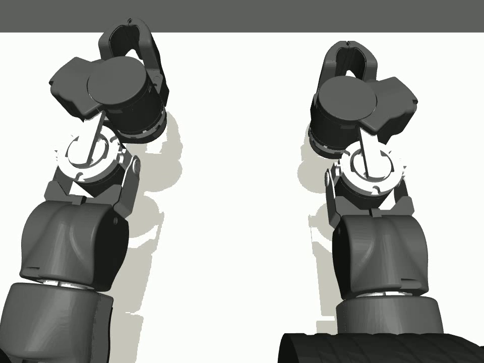
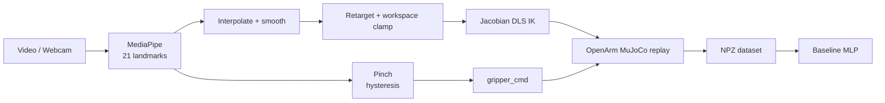
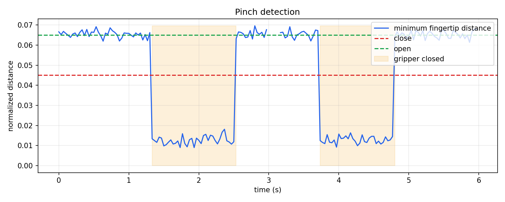
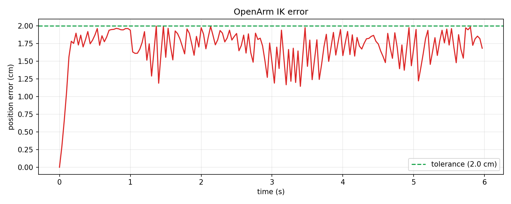

# Video to OpenArm

[](pyproject.toml)
[](https://mujoco.org/)
[](LICENSE)

Pipeline chuyển quỹ đạo cổ tay và động tác pinch từ video/webcam thành chuyển động
end-effector và lệnh đóng/mở gripper của OpenArm trong MuJoCo.

**Kết quả synthetic đã kiểm chứng:** IK trung bình **1.70 cm**, lớn nhất
**2.00 cm**, hội tụ **100%** trên 180 frame.

[Xem video replay MuJoCo](docs/demo/synthetic_openarm_replay.mp4)



## Kiến trúc



## Cài đặt

Python 3.10 trở lên:

```bash
python -m venv .venv
# Windows
.venv\Scripts\activate

python -m pip install --upgrade pip
python -m pip install -e ".[all,dev]"
python scripts/download_hand_model.py
python scripts/00_check_install.py
```

Model HandLandmarker không commit vào Git. Script tải model `Latest` từ
[nguồn chính thức của Google](https://storage.googleapis.com/mediapipe-models/hand_landmarker/hand_landmarker/float16/latest/hand_landmarker.task).

## Chạy nhanh

Chạy toàn bộ pipeline bằng dữ liệu synthetic và render MP4:

```bash
openarm-retarget demo --name synthetic --frames 180 --render
```

Chạy từ video thật:

```bash
openarm-retarget demo \
  --video data/raw_videos/demo_001.mp4 \
  --name demo_001 \
  --render
```

Đầu ra nằm trong:

```text
data/hand_pose/
data/robot_targets/
data/robot_traj/
data/datasets/
outputs/plots/
outputs/debug_videos/
outputs/replay_videos/
outputs/<run_name>_quality_report.json
```

## Các bước

### Bước 0: Kiểm tra môi trường

**Mục tiêu:** xác nhận Python và dependency trước khi xử lý dữ liệu.

```bash
python scripts/00_check_install.py
```

**Đạt khi:** core package báo `[OK]`; package tùy chọn cần cho luồng đang chạy
không báo thiếu.

### Bước 1: Inspect OpenArm

**Mục tiêu:** lấy đúng model, 7 joint, actuator, EE site và keyframe thay vì
hard-code theo giả định.

```bash
python scripts/01_inspect_openarm_model.py
```

**Output:** `outputs/openarm_model_report.txt`.

OpenArm MuJoCo 2.0.0 hiện được nhận diện với:

```text
model: cell.xml
ee_site: left_ee_control_point
arm joints: openarm_left_joint1 ... openarm_left_joint7
gripper actuator: left_finger1_ctrl
home EE: [0.401, 0.1535, 1.12] m
```

### Bước 2: Trích xuất hand pose

**Mục tiêu:** lấy wrist và 5 fingertip trên từng frame bằng MediaPipe Tasks.

```bash
python scripts/02_extract_hand_pose.py \
  --video data/raw_videos/demo_001.mp4 \
  --output data/hand_pose/demo_001_hand_pose.npz \
  --debug-video outputs/debug_videos/demo_001_hand_debug.mp4
```

**Output:** timestamps, wrist, fingertips, handedness, valid mask và video debug.

**Đạt khi:** `valid_tracking_ratio >= 90%` với video đủ sáng, tay không bị che.

### Bước 3: Phát hiện pinch

**Mục tiêu:** đổi khoảng cách thumb-fingertip thành lệnh gripper ổn định.

```bash
python scripts/03_detect_pinch.py \
  --input data/hand_pose/demo_001_hand_pose.npz \
  --output data/hand_pose/demo_001_pinch.npz \
  --plot outputs/plots/demo_001_pinch.png
```

Hysteresis dùng hai ngưỡng: đóng ở `0.045`, mở ở `0.065`; vùng giữa giữ trạng
thái trước để tránh nhấp nháy.



### Bước 4: Làm mượt cổ tay

**Mục tiêu:** nội suy frame mất landmark, moving average và giới hạn vận tốc.

```bash
python scripts/04_smooth_wrist.py \
  --input data/hand_pose/demo_001_pinch.npz \
  --output data/hand_pose/demo_001_smooth.npz \
  --window 7 \
  --plot outputs/plots/demo_001_smoothing.png
```


### Bước 5: Retarget vào workspace OpenArm

**Mục tiêu:** ánh xạ trục camera sang robot, scale chuyển động và clamp workspace.

```bash
python scripts/05_retarget_wrist_to_openarm.py \
  --input data/hand_pose/demo_001_smooth.npz \
  --output data/robot_targets/demo_001_target.npz \
  --plot outputs/plots/demo_001_target.png
```

Config mặc định điều khiển tay trái và dùng EE home thật của OpenArm v2.


### Bước 6: Giải IK

**Mục tiêu:** biến `target_pos[T,3]` thành `qpos[T,nq]` bằng Jacobian damped
least-squares, có joint limit và velocity clamp.

```bash
python scripts/06_openarm_ik.py \
  --input data/robot_targets/demo_001_target.npz \
  --output data/robot_traj/demo_001_qpos.npz \
  --plot outputs/plots/demo_001_ik_error.png
```

**Đạt MVP:** mean error `< 5 cm`, không frame nào `> 20 cm`.



### Bước 7: Replay MuJoCo

**Mục tiêu:** phát lại arm trajectory và gripper đồng bộ.

```bash
# Debug chính xác trajectory
python scripts/07_replay_openarm_mujoco.py \
  --traj data/robot_traj/demo_001_qpos.npz \
  --mode kinematic \
  --output outputs/replay_videos/demo_001.mp4

# Kiểm tra position actuators
python scripts/07_replay_openarm_mujoco.py \
  --traj data/robot_traj/demo_001_qpos.npz \
  --mode actuator
```

Video mặc định: `960x720`, `30 FPS`, camera `camera_head_left`.

### Bước 8: Đóng gói dataset

**Mục tiêu:** tạo observation/action dataset có thể load lại mà không dùng
pickle.

```bash
python scripts/08_log_dataset.py \
  --smooth data/hand_pose/demo_001_smooth.npz \
  --target data/robot_targets/demo_001_target.npz \
  --traj data/robot_traj/demo_001_qpos.npz \
  --output data/datasets/demo_001_dataset.npz
```

Dataset gồm wrist, target, qpos, qvel, EE pose, gripper state và action target.

### Bước 9: Baseline policy

**Mục tiêu:** kiểm tra dataset có học được quan hệ state-to-next-action.

```bash
python scripts/09_train_baseline_policy.py \
  --dataset data/datasets/demo_001_dataset.npz \
  --output models/openarm_baseline.joblib
```

Baseline dùng MLP cho arm joints và logistic classifier cho gripper. Đây là
sanity check, không thay thế controller IK.

## Kiểm thử

```bash
pytest -q
```

Test suite bao phủ schema NPZ, pinch hysteresis, interpolation/smoothing,
axis mapping, model discovery, IK trên OpenArm thật, replay, dataset và pipeline
synthetic end-to-end.

## Cấu hình

| File | Nội dung |
|---|---|
| `configs/hand_tracking.yaml` | MediaPipe backend, confidence, handedness |
| `configs/pinch.yaml` | Ngưỡng close/open và invalid policy |
| `configs/retarget.yaml` | Origin, scale, axis mapping, workspace |
| `configs/ik.yaml` | Tolerance, damping, step và velocity limit |
| `configs/openarm.yaml` | MJCF, side, site, actuator, camera, render |

Đổi sang tay phải bằng `side: right`, `ee_site: auto`,
`gripper_actuator: auto` và cập nhật origin/workspace tương ứng.

## Trạng thái

Chi tiết nghiệm thu nằm trong [PROJECT_REPORT.md](PROJECT_REPORT.md); thiết kế
ban đầu nằm trong [PROJECT_PLAN.md](PROJECT_PLAN.md).

Đường synthetic và OpenArm MuJoCo đã được kiểm chứng end-to-end. Backend
MediaPipe Tasks và model chính thức đã khởi tạo thành công. Repo không chứa
video tay thật, vì vậy tỷ lệ tracking trên camera thực cần được đo bằng video
của người vận hành.

## Nguồn

- [OpenArm MuJoCo](https://github.com/enactic/openarm_mujoco)
- [MuJoCo Python](https://mujoco.readthedocs.io/en/stable/python.html)
- [MediaPipe Hand Landmarker for Python](https://developers.google.com/edge/mediapipe/solutions/vision/hand_landmarker/python)

